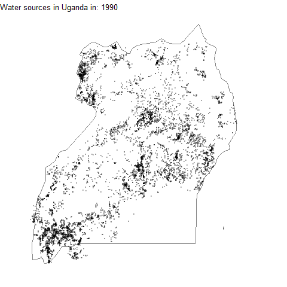

```{r setup, include=FALSE}
knitr::opts_chunk$set(echo = TRUE)

library(tidyverse)
library(scales)
library(lubridate)
library(countrycode)
library(ggmap)
library(gganimate)
library(gifski)
library(png)
theme_set(theme_light())

water0 <- readr::read_csv('https://raw.githubusercontent.com/rfordatascience/tidytuesday/master/data/2021/2021-05-04/water.csv')
```

```{r}
glimpse(water)
```

```{r}
# cleaning the dates 
water <- water0 %>% mutate(report_date = mdy(report_date)) %>% 
  rename(lat = lat_deg,
         long = lon_deg, 
         country = country_name) %>% 
  separate(water_tech, c("water_tech", "brand"), sep = " - ", fill = "right") %>% 
  mutate(install_year = ifelse(install_year > 2021, NA_real_, install_year)) %>% 
  filter(!country %in% c("Peru", "Timor-Leste", "Dominican Republic"), 
         !is.na(country)) %>% 
  filter(between(lat, -35, 37),
         between(long, -40, 60))

```

```{r}
water %>% 
  count(status_id)

water %>% count(water_source, sort = TRUE)

water %>% count(water_tech, sort = TRUE)

# installer needs to be recoded also 
# pay is a free-text column 
water %>% count(pay, sort = TRUE)

water %>% filter(install_year > 1980) %>% 
  count(install_year) %>% 
  ggplot(aes(install_year, n)) +
  geom_col()

water %>% count(status_id, status, sort = TRUE)
```

```{r}
water %>% count(country_name, sort = TRUE)
```

```{r}

countries <- unique(water$country)

water %>% 
  sample_n(50000) %>% 
  ggplot(aes(x = lon, y = lat)) +
  geom_point() +
  borders("world", regions = countries)

water %>% 
  group_by(country) %>% 
  summarise(lat = mean(lat),
            lon = mean(lon)) %>% 
  ggplot(aes(x = lon, y = lat)) +
  geom_point() +
  geom_text(aes(label = country), vjust = 1, hjust = 1)

africa_map <- map_data("world") %>% 
  as.tibble() %>% 
  mutate(continent = countrycode(region, "country.name", "continent")) %>% 
  filter(continent == "Africa")

water %>% 
  sample_n(50000) %>% 
  ggplot(aes(long, lat)) +
  geom_polygon(aes(long, lat, group = group), 
               colour = "grey",
               fill = "white",
               data = africa_map,
               size = 0.25) +
  geom_point(size = 0.1, alpha = 0.25) +
  theme_void()
  
```

```{r}

uganda <- water %>% 
  filter(country == "Uganda", 
         between(lat, -2, 4),
         between(long, 29, 40))

uganda %>% 
  ggplot(aes(x = long, y = lat, colour = status_id)) +
  borders("world", regions = "Uganda") +
  geom_point(size = 0.1, alpha = 0.25) +
  scale_colour_discrete(guide = guide_legend(override.aes = list(size = 2, alpha = 1))) +
  theme_void()

get_map("Uganda", source = "osm")

bbox <- c(left = 29.2, bottom = -2, right = 35, top = 4.2)

uganda_map <- get_stamenmap(bbox, zoom = 8)

ggmap(uganda_map) +
  geom_point(aes(x = long, y = lat),
             data = uganda, size = 0.1, alpha = 0.1)
```

```{r}
uganda %>% count(pay, sort = TRUE)

uganda_lumped <- uganda %>% 
  mutate(water_source = fct_lump(water_source, 5)) %>% 
  replace_na(list(water_source = "Other")) %>% 
  mutate(water_source = fct_reorder(water_source, water_source, length, .desc = TRUE))

ggmap(uganda_map) +
  geom_point(aes(x = long, y = lat),
             data = uganda_lumped, size = 0.1, alpha = 0.1) +
  facet_wrap(~ water_source)

```

```{r}
uganda_lumped %>% 
  mutate(report_year = year(report_date)) %>% 
  count(report_year, water_source) %>% 
  complete(report_year, water_source, fill = list(n = 0)) %>% 
  group_by(report_year) %>% 
  mutate(year_total = sum(n)) %>% 
  filter(year_total >= 500) %>% 
  ggplot(aes(x = report_year, y = n/year_total, fill = water_source)) +
  geom_area()

uganda_lumped %>% 
  mutate(water_tech = fct_lump(water_tech, 5)) %>% 
  mutate(report_year = year(report_date)) %>% 
  count(report_year, water_tech) %>% 
  complete(report_year, water_tech, fill = list(n = 0)) %>% 
  group_by(report_year) %>% 
  mutate(year_total = sum(n)) %>% 
  filter(year_total >= 500) %>% 
  ggplot(aes(x = report_year, n, fill = water_tech)) +
  geom_area()
```

```{r}
uganda %>% 
  ggplot(aes(report_date, y = install_year)) +
  geom_point(alpha = 0.25)
```

```{r}
uganda_gif <- uganda %>% 
  filter(!is.na(install_year)) %>% 
  mutate(install_year = pmax(1990, install_year)) %>% 
  mutate(year = map(install_year, ~seq(., 2021))) %>% 
  unnest(year) %>% 
  ggplot(aes(x = long, y = lat)) +
  borders("world", regions = "Uganda") +
  geom_point(size = 0.1, alpha = 0.25) +
  theme_void() +
  scale_colour_discrete(guide = guide_legend(override.aes = list(size = 2, alpha = 1))) +
  transition_manual(year) + 
  labs(title = "Water sources in Uganda in: { current_frame }")

anim_save("uganda.gif", animation = uganda_gif)
```



```{r}
uganda %>% 
  filter(!is.na(install_year)) %>% 
  sample_n(30000) %>% 
  mutate(install_year = pmax(1990, install_year)) %>% 
  mutate(year = map(install_year, ~seq(., 2021))) %>% 
  unnest(year) %>% 
  ggplot(aes(x = long, y = lat)) +
  borders("world", regions = "Uganda") +
  geom_point(size = 0.1, alpha = 0.25) +
  theme_void() +
  scale_colour_discrete(guide = guide_legend(override.aes = list(size = 2, alpha = 1))) +
  transition_manual(year) + 
  labs(title = "Water sources in Uganda in: { current_frame }")
,,```

